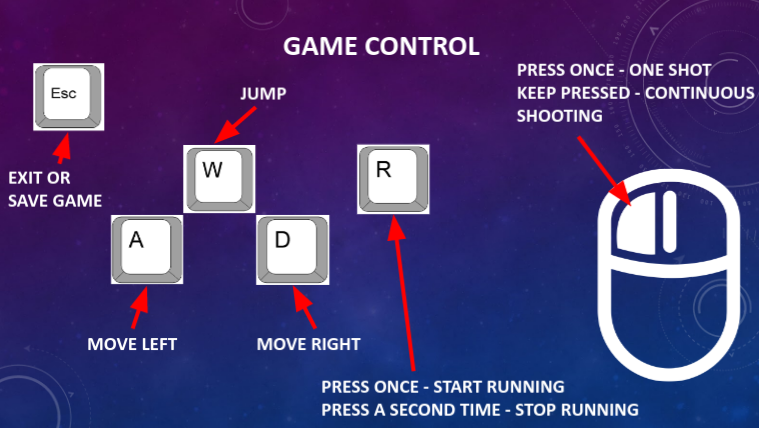

# Unity Game
A simple 2.5D platform game developed in [Unity](https://unity.com/). You take control over a sci-fi warrior helping him to collect SD cards needed to open a door to the next level. To make the task harder you will need to fight multiple spiky opponents who will try to shoot you down. To refill your HP point you can collect special items - briefcases. Other items will increase your score points.

## Screenshots

## Game control

## Download

The source code of the game you can download from [here](https://www.dropbox.com/s/02gitsds9uz0vsv/UnityGame.zip?dl=0).

Below, you can download compiled versions of the game for different platforms:
[Windows](https://www.dropbox.com/s/36h6z037prkjkgh/Windows.zip?dl=0), \
[MacOS](https://www.dropbox.com/s/ykbv8cmu33y1777/MacOS.tar.gz?dl=0), \
[Linux](https://www.dropbox.com/s/t3m7xlh5gp155yu/Linux.tar.gz?dl=0).